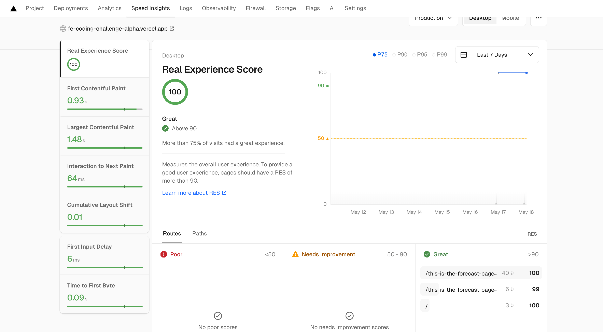

# FE Coding Challenge – Wetter.com

This project is a solution for the Frontend Coding Challenge as described in the original instructions:  
👉 [https://github.com/wettercom/fe-coding-challenge](https://github.com/wettercom/fe-coding-challenge)

## 🌐 Live Demo

You can test the deployed version here:

- [7-Day Forecast](https://fe-coding-challenge-alpha.vercel.app/this-is-the-forecast-page/7-days/DE0001020.html)
- [3-Day Forecast](https://fe-coding-challenge-alpha.vercel.app/this-is-the-forecast-page/3-days/DE0001020.html)

## 🔧 Important Highlights
* You can navigate to forecast page using /forecast or /this-is-the-forecast-page and **I used /this-is-the-forecast-page  as base url cause it was required in the readme ,for sure in real experience I will ask on reason for using it before implementing it**

* Weather is being shown for the next 3 or 7 days excluding today
* For bots all weather panel are expanded by default 
* Location data is cached forever but weather data is revalidated every 24h to get weather info for the new day
* Added two unit tests just to show simple cases

##  Archtecture 

* Cause application is very small and simple used flat arch but for more complex its better to use [feature sliced design](https://feature-sliced.github.io/documentation/)

* Used container presentation pattern for state management 

### ✅ URL Matching Logic

 * Matches forecast URLs following the documented schema in the readme:
 * Supports only "3-days" or "7-days" in the path
 * Accepts either "forecast" or "this-is-the-forecast-page" as the base path
 * Restricts the file extension to ".html" (or none)
 * Ignores other extensions like .json or .xml
 
 
## 🔧 Performance 
Project is achieving core web vitals 100% score on vercel montioring platform 

